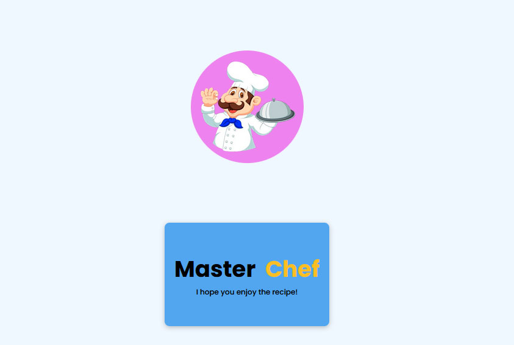
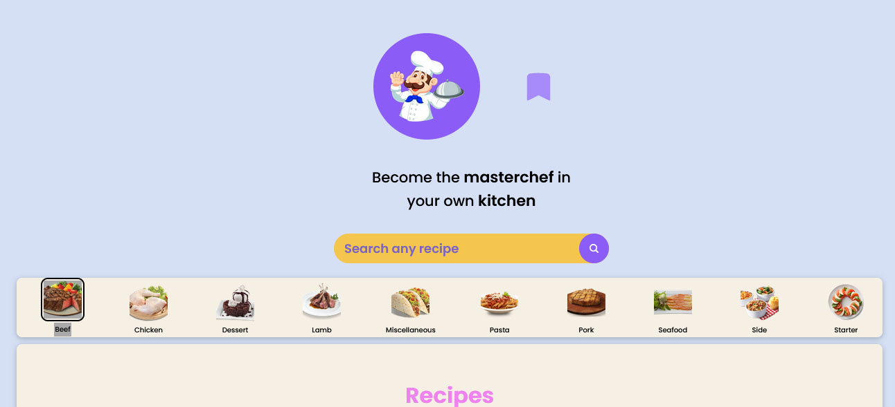
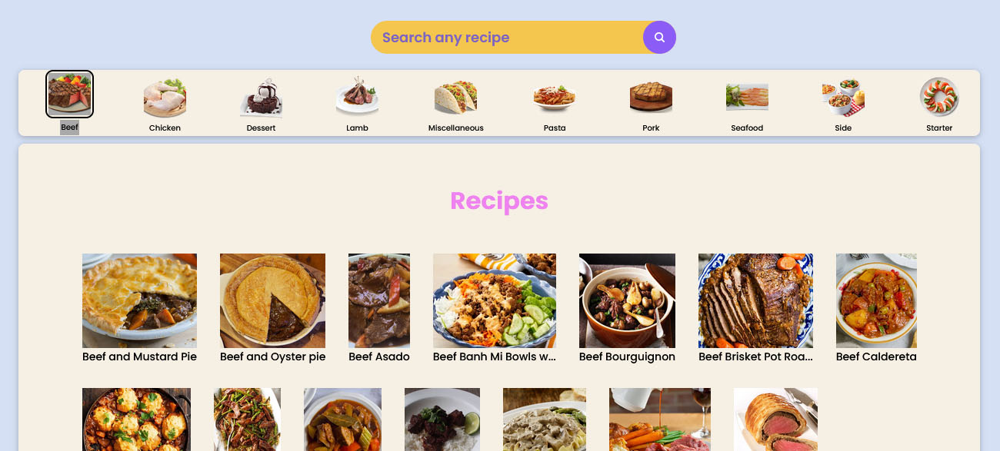
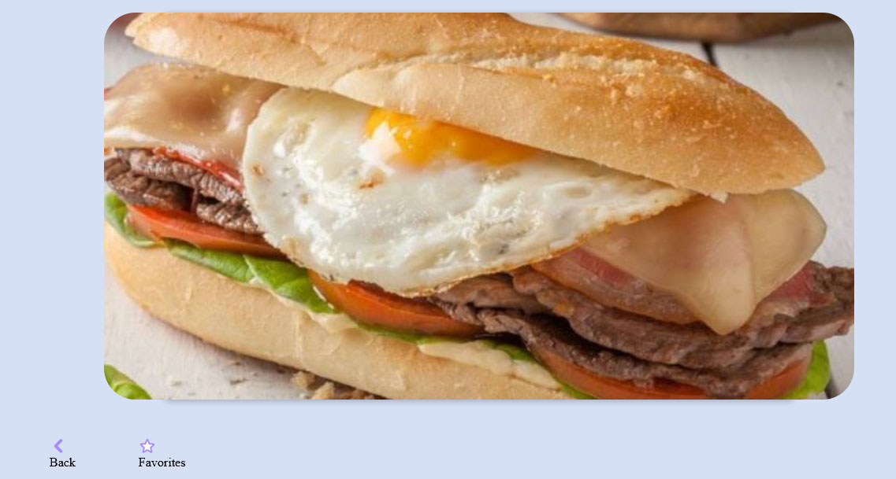
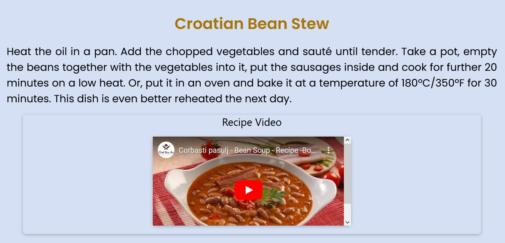
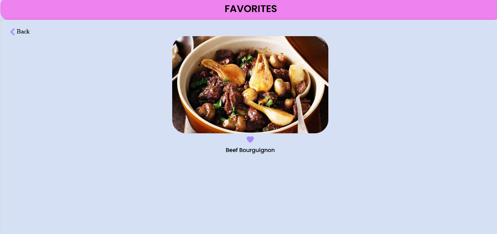

<h1 align ="center" > 🏆 SerCheff - Food Recipe App  </h1>
<h3  align ="center"> 
a mobile application where users can search, view, and add favorite your own food recipes. This application is built using 
  technologies such as React Native, Redux Toolkit, NativeWind, Expo CLI, React Navigation, React Native Reanimated, and Axios. </h3>
<br>

  * [Configuration and Setup](#configuration-and-setup)
  * [Key Features](#key-features)
  * [Technologies used](#technologies-used)
      - [Frontend](#frontend)
  * [📸 Screenshots](#screenshots)
  * [Author](#author)
  * <br>
  * ## Configuration and Setup

In order to run this project locally, simply fork and clone the repository or download as zip and unzip on your machine.

- Open the project in your prefered code editor.
- Go to terminal -> New terminal (If you are using VS code)

```
$ cd client
$ npm install (to install client-side dependencies)
$ npx expo start -c  (to start the application - cleaning Cache Memory)

```


## ✔️ Tecnologias Utilizadas:


<br>
##  Screenshots:
<br>






<br>

##  Key Features:

- Choose Diferents Kinds of Recipes
- See from Youtube th video Recipe
- Get the List of Elements and Preparition of Recipes
- Choose Favorite Recipes

  
<br/>

##  Technologies used

This project was created using the following technologies.

####  Frontend 

- [React Native ]
 It is a framework developed by Facebook for creating native-style apps for iOS & Android under one common language, JavaScript.
- [React Hooks  ](https://reactjs.org/docs/hooks-intro.html) - For managing and centralizing application state
- [react-navigation/native](https://reactnavigation.org/)) - To handle routing
- [RN - styled Components](https://styled-components.com/docs/basics) - Utilises tagged template literals to style your components
- [React Redux-toolkit](https://react-redux.js.org/) - manage application state efficiently and provide a more structured mechanism for managing data
- [Tailwind]

## Author
- Portfolio: 
- Github: 
- Sponsor: 
- Linkedin:(https://www.linkedin.com/in/sergio-moncada-72589883/)
- Email: [sergiogmoncada@yahoo.com](mailto:sergiogmoncada@yahoo.com)

